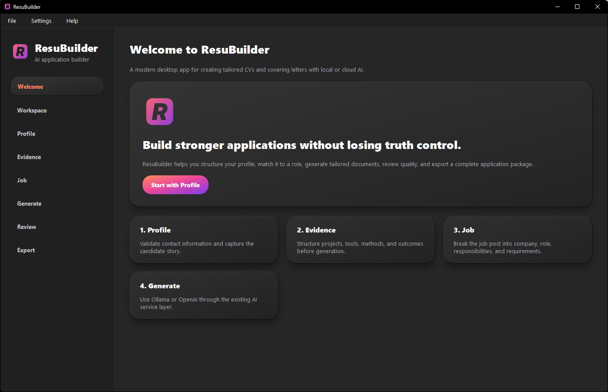
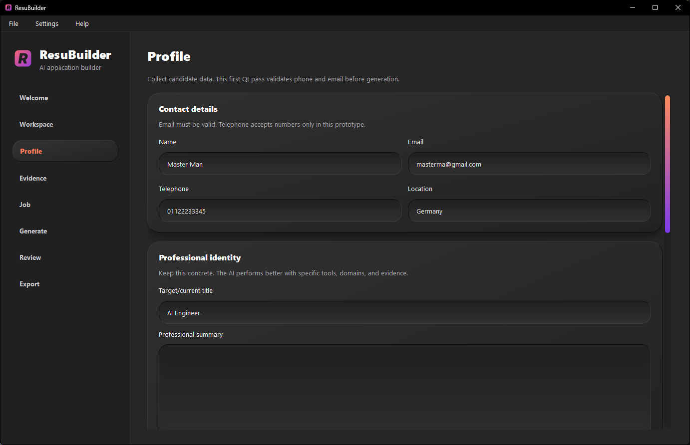
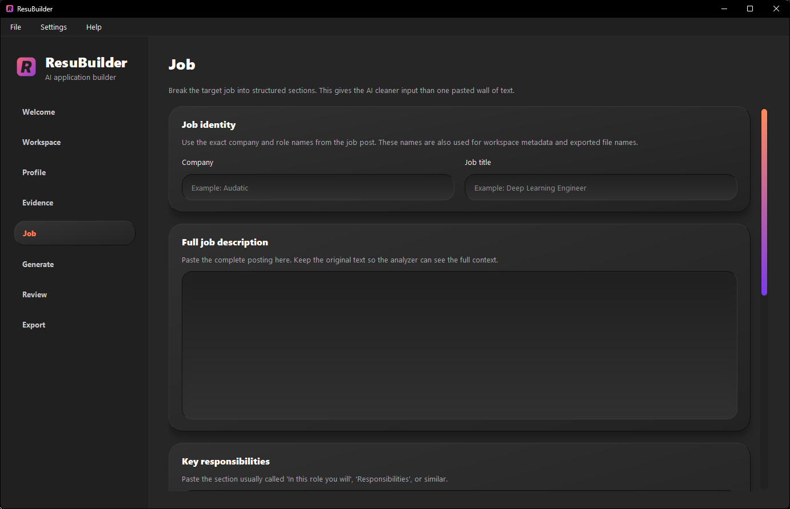
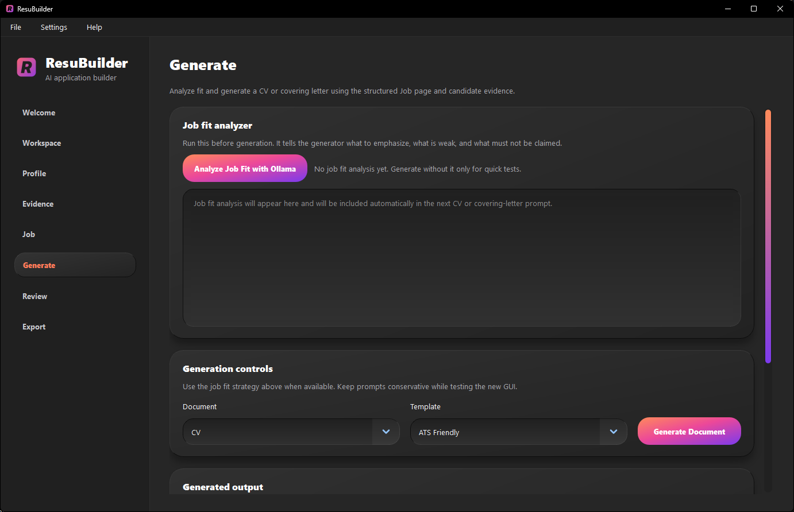
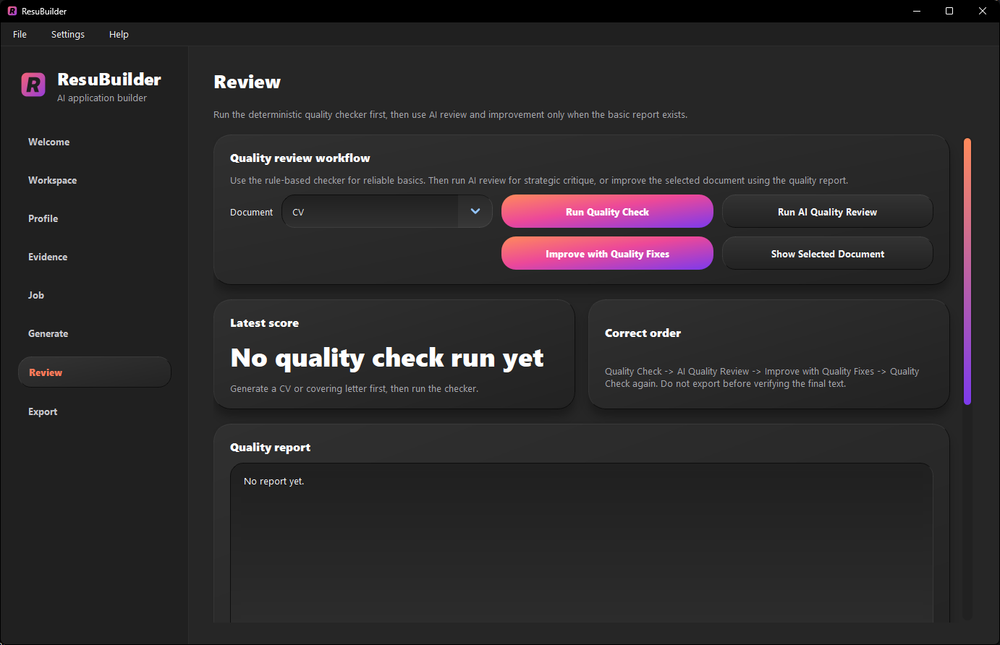
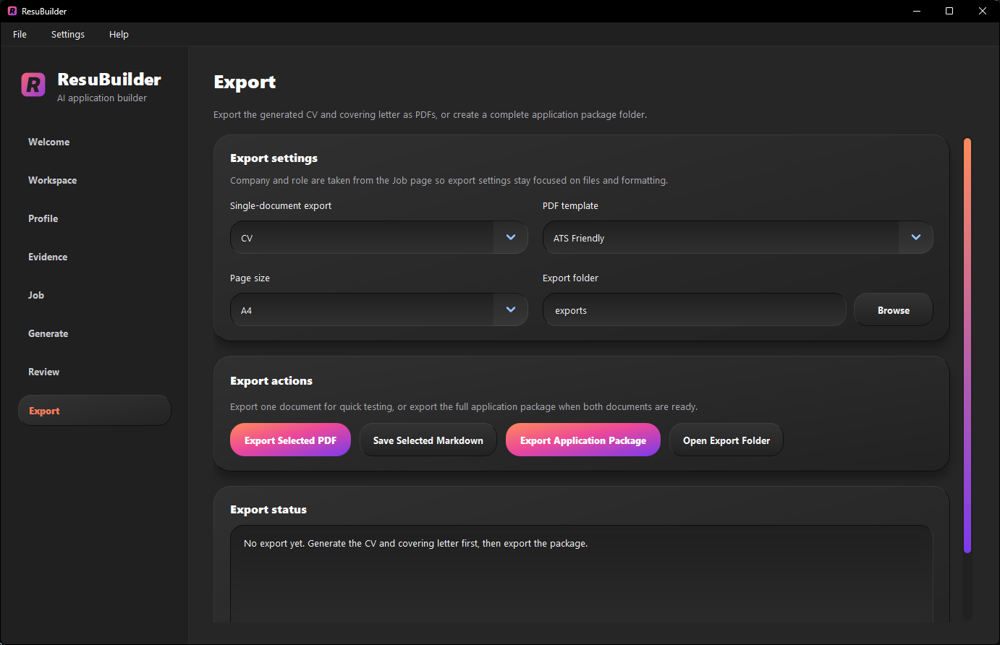

# ResuBuilder

ResuBuilder is a desktop application for creating tailored CVs and covering letters for specific job applications. It helps users structure their profile, capture job requirements, analyze job fit, generate tailored documents with AI, review quality, and export a complete application package.

The app supports local AI through Ollama and optional OpenAI API usage. The primary interface is built with PySide6/Qt.

## Current release

**Version:** v0.1.0 release candidate

This is the first functional release candidate. It is suitable for local testing and personal use, not yet a polished public product.

## Main features

- Modern PySide6/Qt desktop interface
- Local AI generation with Ollama
- Optional OpenAI provider support
- Structured profile builder
- Structured evidence builder
- Structured job page
- Job fit analysis before generation
- Tailored CV generation
- Tailored covering letter generation
- Rule-based quality check
- AI quality review
- Improve with quality fixes workflow
- PDF export
- Complete application package export
- Workspace save/load
- Profile save/load/import/export
- Theme support: Light, Dark, Dark blue, Modern 3D Light, Modern 3D Dark
- Legacy GUI preserved as a fallback through `app_legacy.py`

## Screenshots










## Requirements

- Windows 10 or later recommended
- Python 3.10+ for running from source
- Ollama for local AI generation
- Optional OpenAI API key if using OpenAI instead of Ollama

## Recommended local AI setup

Install Ollama, then pull a model:

```powershell
ollama pull qwen3:14b
```

Test it:

```powershell
ollama run qwen3:14b
```

Recommended models:

```text
qwen3:14b  - best first local model for quality
qwen3:8b   - faster testing
llama3.1:8b - backup option
```

## Run from source

Clone the repository, create a virtual environment, install dependencies, and run the app:

```powershell
python -m venv .venv
.\.venv\Scripts\activate
pip install -r requirements.txt
python app.py
```

The legacy GUI can still be opened with:

```powershell
python app_legacy.py
```

## Build Windows executable

From the project root:

```powershell
scripts\build_windows.ps1
```

Run the executable:

```powershell
dist\ResuBuilder\ResuBuilder.exe
```

Do not commit `build/` or `dist/`. The executable should be uploaded as a GitHub Release asset.

## Data storage

Local user data is stored under `data/`.

Typical local files include:

```text
data/settings.json
data/candidate_profile.json
data/applications/*.json
```

These files may contain personal information and should not be committed to GitHub.

## Export output

Application packages are exported to the selected export folder and may include:

```text
CV PDF
Covering letter PDF
CV Markdown source
Covering letter Markdown source
quality_report.md
application_summary.json
```


## Known limitations

See [`docs/KNOWN_LIMITATIONS.md`](docs/KNOWN_LIMITATIONS.md).

## Packaging instructions

See [`docs/WINDOWS_PACKAGING.md`](docs/WINDOWS_PACKAGING.md).

## Release checklist

See [`docs/RELEASE_PREP_CHECKLIST.md`](docs/RELEASE_PREP_CHECKLIST.md).
